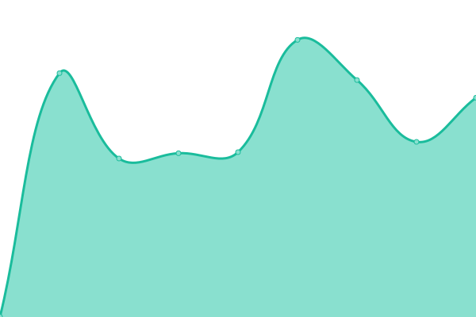

uptime

# Uptime

Learn how to set up this Upptime:

- [Upptime Getting Started](https://upptime.js.org/docs/get-started)
- [Create personal access token request for organization](https://stackoverflow.com/questions/75044318/create-personal-access-token-request-for-organization)

# [📈 Live Status](https://status.agility-game.com): <!--live status--> **🟥 Complete outage**

This repository contains the open-source uptime monitor and status page for [Agility Game](https://agility-game.com), powered by [Upptime](https://github.com/upptime/upptime).

With [Upptime](https://upptime.js.org), you can get your own unlimited and free uptime monitor and status page, powered entirely by a GitHub repository. We use [Issues](https://github.com/agility-game/uptime/issues) as incident reports, [Actions](https://github.com/agility-game/uptime/actions) as uptime monitors, and [Pages](https://status.agility-game.com) for the status page.

<!--start: status pages-->
<!-- This summary is generated by Upptime (https://github.com/upptime/upptime) -->
<!-- Do not edit this manually, your changes will be overwritten -->
<!-- prettier-ignore -->
| URL | Status | History | Response Time | Uptime |
| --- | ------ | ------- | ------------- | ------ |
|  [Agility Game Landing Page](https://agility-game.com) | 🟥 Down | [agility-game-landing-page.yml](https://github.com/agility-game/uptime/commits/HEAD/history/agility-game-landing-page.yml) | 

 0ms
     
 | 

<a href="https://status.agility-game.com/history/agility-game-landing-page">0.00%</a>
    

|  [Agility Game API](https://app.agility-game.com/live) | 🟥 Down | [agility-game-api.yml](https://github.com/agility-game/uptime/commits/HEAD/history/agility-game-api.yml) | 

 0ms
     
 | 

<a href="https://status.agility-game.com/history/agility-game-api">0.00%</a>
    

<!--end: status pages-->

[**Visit our status website →**](https://status.agility-game.com)

## 📄 License

- Powered by: [Upptime](https://github.com/upptime/upptime)
- Code: [MIT](./LICENSE) © [Agility Game](https://agility-game.com)
- Data in the `./history` directory: [Open Database License](https://opendatacommons.org/licenses/odbl/1-0/)
